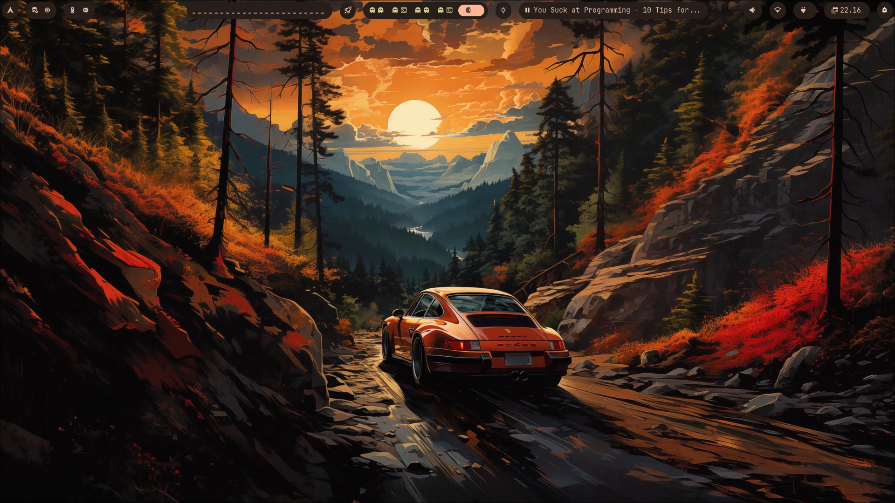

# Welcome to Matrix Hyprland Dotfiles

A fully themed **Arch Linux** Hyprland rice powered by [matugen](https://github.com/InioX/matugen) for automatic Material You color generation.



## The Story

I got tired of it.

Tired of cloning someone else's dotfiles, running their install script, and watching things break in ways I couldn't understand. Tired of themes that looked great in screenshots but fell apart on my hardware. Tired of spending more time fixing broken configs than actually using my system.

So I decided to build my own.

Every config here was written from scratch, tested on real hardware, and designed to work together as a cohesive system. No black-box multi-profile installers. Just clean, modular configs that you can explain, debug, and improve.

This rice is the result of that philosophy. It's a reproducible, maintainable Arch Linux setup that anyone can clone, install, and understand.

## Philosophy

- **Reproducible** — clone the repo, run the installer, get the same setup every time
- **Resilient** — a failed package never kills the whole install
- **Automatic** — colors generate from your wallpaper, not hardcoded
- **Consistent** — every app uses the same palette, from GTK to Qt to Firefox to Neovim

## What you get

| Component | Description |
|---|---|
| Hyprland | Window manager with animations and blur |
| Hyprlock | Lock screen with blurred wallpaper and matugen colors |
| Wlogout | Glass-morphism logout menu |
| Waybar | Modular status bar |
| Rofi | App launcher, WiFi menu, Bluetooth selector |
| Cava | Terminal audio visualizer |
| SwayNC | Notification center themed with matugen |
| Neovim | LazyVim with custom matugen colorscheme |
| GTK3/GTK4 | Desktop apps themed with matugen |
| Qt5/Qt6 | Qt apps using Fusion + matugen palette |
| Wallpapers | Bundled set applied by the installer |

## Quick start

```bash
git clone https://github.com/matrix-node/hyprland_dotfiles.git ~/hyprland_dotfiles
cd ~/hyprland_dotfiles
./install.sh --yes
reboot
```

See the [Installation](Installation) page for detailed steps.
